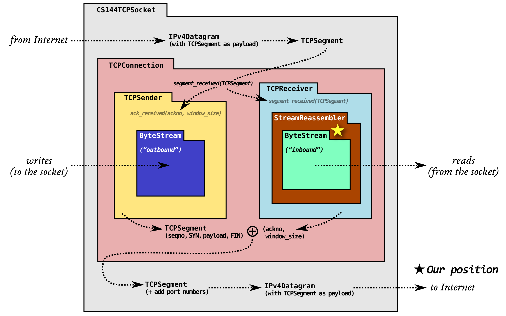
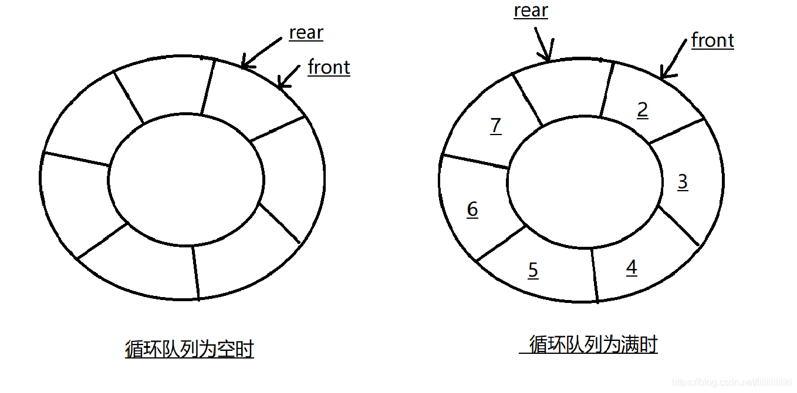

# CPP-TCP: LAB 0

## 问题

（webget 略。）本次实验是一个入门课，要求实现内存中可靠字节流（ in-memory reliable byte stream）。后续的实验中将充分使用此模块。

## 要点

1. 字节流实际上是一个循环队列。
2. 我们选择使用在队列中外加一个冗余位的方式判断队列是满还是空。
   
3. 冗余位不一定是空的。如果你的实现中 `pop_output` 没有将已弹出的字节置空（这很好），那么若干次读写之后冗余位几乎一定不是空的。
4. 此模块需要在循环队列上额外实现记录读写字节数、记录写入结束位的功能。这不会导致算法与普通的循环队列有多少差别。