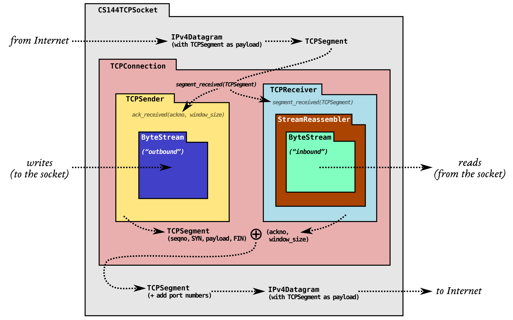

# CPP-TCP: LAB 2

## 问题

TCP协议通过不可靠的数据报可靠地传递一对流量控制的字节流。连接双方参与TCP连接，每一方同时作为出境数据（其自身发出的字节流）的发送方和入境数据（从对方传入的字节流）的接收方。本次实验实现的是图中的 `TCPRecevier` 部分。

作为接收端所需的基础设施，还需要实现 64 位整型与 32 位整型互转的函数。

## 要点

### 实现 `WrappedInt32`

`WrappingInt32` 是表示 seqno 和 ackno 的数据类型。网络上不乏在 `unwrap`中大量使用判断语句保证返回值符合要求，其实大可不必。

* `int32_t offset = n - wrap(checkpoint, isn);` 即可获得 n 与 checkpoint 之间最小的偏移量。把这个偏移量有符号地加到 checkpoint 上即可。
* 如果相加结果最高位为 1，那么分两种情况：
  1. 在与偏移量的计算时出现了溢出。（例如offset=-1, checkpoint=0）此时需要修正结果，先把减掉的 offset 再加回去（消除上一步的影响），然后再无符号地加上 offset。这两步合在一起，只需给结果加上 `1ull << 32` 即可。
  2. 确实应该为 1。（例如offset=1, checkpoint=1ull<<63）这种情况几乎不存在，因为这意味着此次TCP连接传输至少了8EiB（约86亿GiB）的数据。所以本课程没有对这种情况进行任何测试。

### 处理 SYN/FIN

对于 SYN 的处理，有以下两点：

* 在收到 SYN 之前收到的任何数据都不要管。
* 有 SYN 标志的包的 seqno 是 isn。

对于 FIN 的处理，只需把它当作 EOF 交给上次实验中实现的 `StreamReassembler`。

此外，SYN 和 FIN 都占用一个序列号，计算 ackno 时需要注意。

### 处理三种序号

绝对序列号可以直接用 `unwrap(header.seqno, WrappingInt32(_isn), ackno)` 得到。

`stream_index` 的算法稍微复杂一些。当包中不包含 SYN 标志时，其值为绝对序列号减一，因为在 `stream_index` 中不计算 SYN 标志的位置；当包中包含 SYN 标志时，其值为绝对序列号加一再减一，因为数据是从绝对序列号+1开始的。

### 处理收到的数据

调用 `_reassembler.push_substring()` 即可。

### 计算 ackno

`ackno = wrap(_checkpoint, WrappingInt32(_isn))`，其中 `_checkpoint` 是期待的下一个数据包的绝对序列号，可以通过写入流中的字节数计算得到，包装之后就得到了 `ackno`。在收到 FIN 且数据已经全部写完后，`_checkpoint` 应该再 +1。

