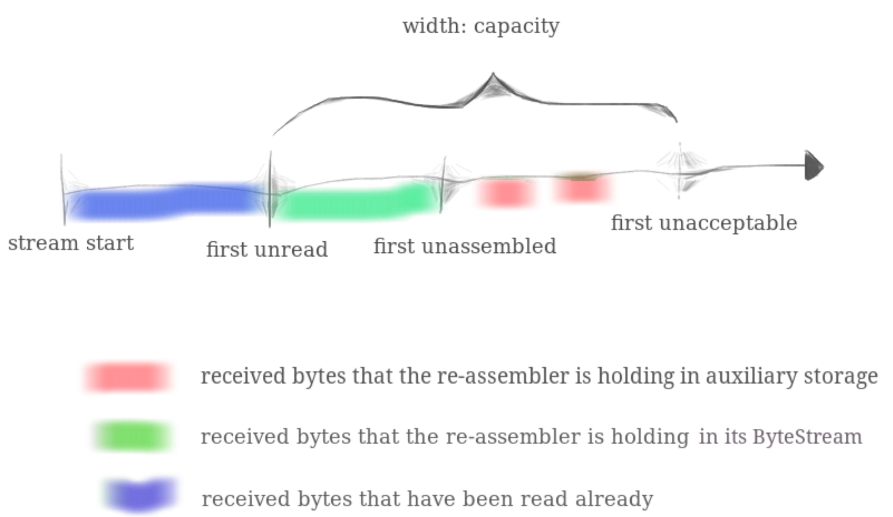

# CPP-TCP: LAB 1

## 问题

**TCP 发送方将其字节流分成短段**（每个子串不超过1460字节），以便使它们各自符合数据报的要求。**但网络在传输数据时可能会将这些数据报重新排序、丢弃、或者重复发送**。接收方必须**将这些片段重新组合成它们开始时的连续字节流**。

**本实验需要编写负责重新组装的数据结构**，在实验代码中定义为 `StreamReassembler`。它将接收由一串字节组成的**子串**，以及该串在大流中的**第一个字节的索引**。流中的每个字节都有自己的唯一索引，从零开始递增。`StreamReassembler` 拥有一个用于输出的 `ByteStream`（在 lab0 实现），**一旦 `Reassembler` 知道流的下一个字节，就把它写入 `ByteStream` 中**。TCPSocket 的所有者（用户）可以随时访问并从 `ByteStream` 中读取。

## 俯瞰

`StreamReassembler` 是 `TCPReceiver` 的一部分，负责处理从网络（*from Internet*）接收到的数据包，将数据写入“入境字节流”（图中浅绿色）。 TCPSocket 的 `read` 函数读取的就是这里面的数据（*reads from the socket*）。

注意，图中蓝色的“出境字节流”与浅绿色的“入境字节流”是两个对象，两者没有联系。

## 要点

### 组装

组装就是把已经收到的字节排好序并写入 `ByteStream` 的过程。由于 `StreamReassembler` 收到的子串可能是乱序、断续、重叠（不只是重复）的，因此需要将多个数据包的数据整合，将其连接成一段有序连续的字节串，然后写入 `ByteStream`。

### `StreamReassembler` 需要维护一个字节缓冲

`ByteStream` 不允许随机写入，只能写到其已有数据的结尾，因此不是收到数据就写入，而需要先判断收到的数据中是否包含 `ByteStream` 所需的下一个字节，如有才可以写入。这样的过程必然需要维护一个字节缓冲。

### 尽可能组装

实验要求“*一旦 `Reassembler` 知道流的下一个字节，就把它写入 `ByteStream` 中*”。

### 正确处理 EOF

`StreamReassembler` 需要在合适的时机调用 `ByteStream::end_input()` 函数结束输入，向字节流表明此为数据的结尾。但 `StreamReassembler` 可能提前收到 `EOF` 标识，所以还要判断所有字节是否已被全部组装。若是则可结束输入。

### 正确处理 capacity

capacity 参数表示的含义是：字节流缓冲中未被读出部分（*unread*）的最大长度。“被读出”指已被 `ByteStream::read(n)` 输出。已被读出部分的长度可由 `ByteStream::bytes_read()` 获得。

因此，`StreamReassembler` 允许的最大索引为 `ByteStream::bytes_read() + capacity - 1 `，超出部分（包括EOF信号）应当被丢弃（*unacceptable*）。